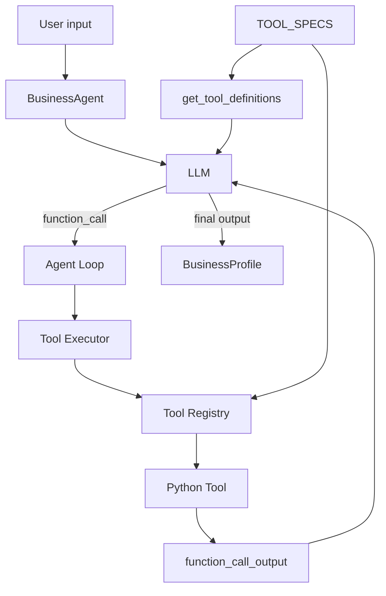

# WebAgent

WebAgent es un proyecto de aprendizaje y desarrollo de un sistema de agentes de IA capaz de transformar la información de un pequeño negocio en una web profesional con la mínima intervención manual posible.

El objetivo principal del proyecto no es empezar usando un framework agentic, sino **entender y construir manualmente los mecanismos básicos de un agente** —contexto, structured outputs, tools, tool calling, agent loops, estado y guardrails— para poder abstraerlos más adelante con criterio.

## Estado actual

Actualmente el proyecto se encuentra en una fase temprana y didáctica. Ya existe un primer `BusinessAgent` capaz de:

- Recibir instrucciones y una descripción libre de un negocio.
- Producir un `BusinessProfile` estructurado con Pydantic.
- Decidir si necesita utilizar herramientas.
- Solicitar cero, una o varias tools en una inferencia.
- Permitir que Python ejecute las tools reales.
- Incorporar sus resultados al contexto mediante `function_call_output`.
- Repetir el ciclo dentro de un Agent Loop con límite de pasos.
- Finalizar cuando dispone de información suficiente.
- Resolver las tools mediante un `Tool Registry` y un `Tool Executor` genéricos.
- Mantener `TOOL_SPECS` como única fuente de verdad de las herramientas disponibles.

En la prueba actual, el modelo fue capaz de solicitar `search_business` y `search_business_preferences` en el mismo paso y completar el `BusinessProfile` en la siguiente inferencia.

> Nota: aunque el modelo puede solicitar varias tools en una misma inferencia, por ahora Python las ejecuta secuencialmente dentro del loop.

## Arquitectura actual



La idea central es mantener separadas estas responsabilidades:

- **LLM:** decide qué necesita hacer.
- **Agent Loop:** coordina el ciclo observar -> decidir -> actuar -> observar.
- **TOOL_SPECS:** catálogo y única fuente de verdad de las tools.
- **Tool Registry:** índice `nombre -> función` derivado de `TOOL_SPECS`.
- **Tool Executor:** ejecuta una tool genéricamente a partir de su nombre y argumentos.
- **Python tools:** implementan las acciones reales.

## Flujo del BusinessAgent

```text
USER
  |
  v
BUSINESS AGENT
  |
  v
LLM
  |
  +--> salida final ------------------------> BusinessProfile
  |
  +--> function_call
          |
          v
      Tool Executor
          |
          v
      Tool Registry
          |
          v
       Python Tool
          |
          v
   function_call_output
          |
          +-------------------------------> LLM
```

## BusinessProfile

El contrato de salida actual es:

```python
class BusinessProfile(BaseModel):
    name: str | None
    business_type: str
    location: str | None
    services: list[str]
    main_goal: str | None
    desired_style: list[str]
```

La salida estructurada permite que futuros agentes consuman información estable sin depender de texto libre.

## Sistema de Tools

Cada tool tiene dos caras:

1. Una `definition`, que describe al modelo el nombre, propósito y argumentos disponibles.
2. Un `handler`, que apunta a la función Python que ejecuta realmente la acción.

Ambas se registran en `TOOL_SPECS`:

```python
TOOL_SPECS = [
    {
        "definition": SEARCH_BUSINESS_DEFINITION,
        "handler": search_business,
    },
    {
        "definition": SEARCH_BUSINESS_PREFERENCES_DEFINITION,
        "handler": search_business_preferences,
    },
]
```

A partir de este catálogo se construyen las dos estructuras que necesita el sistema:

```python
def get_tool_definitions():
    return [
        spec["definition"]
        for spec in TOOL_SPECS
    ]


TOOL_REGISTRY = {
    spec["definition"]["name"]: spec["handler"]
    for spec in TOOL_SPECS
}
```

El Agent Loop no necesita conocer ninguna tool concreta:

```python
arguments = json.loads(item.arguments)

result = execute_tool(
    tool_name=item.name,
    arguments=arguments,
)
```

Esto permite añadir nuevas herramientas sin introducir nuevos `if/elif` en `main.py`.

## Tools implementadas

### `search_business`

Busca información básica conocida sobre un negocio, como nombre, tipo, ubicación y servicios.

### `search_business_preferences`

Busca información adicional sobre el objetivo principal del negocio y sus preferencias de estilo.

Actualmente ambas utilizan bases de datos locales simuladas para poder estudiar el mecanismo de tool calling sin añadir todavía búsquedas web, APIs externas o fallos de red.

## Estructura actual

```text
WebAgent/
|-- .env
|-- .gitignore
|-- requirements.txt
|
`-- src/
    |-- main.py
    |
    `-- tools/
        |-- business_tools.py
        `-- tool_registry.py
```

La estructura se mantiene deliberadamente pequeña. Se introducirán nuevas carpetas y abstracciones cuando exista una necesidad real.

## Instalación

### 1. Crear un entorno virtual

```bash
python3 -m venv .venv
source .venv/bin/activate
```

### 2. Instalar dependencias

```bash
pip install openai python-dotenv pydantic
```

También se puede mantener un `requirements.txt` y ejecutar:

```bash
pip install -r requirements.txt
```

### 3. Configurar la API key

Crear un fichero `.env` en la raíz:

```env
OPENAI_API_KEY=tu_api_key
```

El fichero `.env` debe permanecer fuera de Git mediante `.gitignore`.

### 4. Ejecutar

Desde la raíz del proyecto:

```bash
python src/main.py
```

## Principios de diseño

- Primero entender el mecanismo; después utilizar frameworks que lo automaticen.
- El modelo decide **qué** acción necesita; Python decide **cómo** se ejecuta.
- Una tool call no ejecuta una función por sí sola.
- El software mantiene el control de qué acciones existen y están permitidas.
- Los outputs entre componentes deben ser estructurados siempre que sea razonable.
- El Agent Loop no debe conocer implementaciones concretas de tools.
- `TOOL_SPECS` es la única fuente de verdad del catálogo de herramientas.
- La lógica determinista debe resolverse con software tradicional siempre que sea posible.
- Los loops deben tener límites explícitos como `MAX_STEPS`.
- La complejidad arquitectónica se añade cuando aparece una necesidad real.

## Roadmap

### Completado

- [x] Primera inferencia desde Python.
- [x] Context Engineering con roles.
- [x] Structured Output con Pydantic.
- [x] Primera tool real.
- [x] Tool calling.
- [x] `function_call_output`.
- [x] Agent Loop con límite de pasos.
- [x] Tool Registry.
- [x] Tool Executor genérico.
- [x] `TOOL_SPECS` como fuente de verdad.
- [x] Múltiples tools reales.
- [x] Múltiples tool calls en una inferencia.

### Próximos pasos

- [ ] Permisos y selección de tools por agente.
- [ ] Guardrails por agente.
- [ ] Shared State.
- [ ] Persistencia.
- [ ] Logging y observabilidad.
- [ ] ResearchAgent.
- [ ] UXAgent.
- [ ] CopyAgent.
- [ ] DesignAgent.
- [ ] DeveloperAgent.
- [ ] Validator determinista.
- [ ] Orquestación multiagente.
- [ ] Comparación SLM vs. LLM por responsabilidad.
- [ ] Evaluación de frameworks como LangGraph, CrewAI o LangChain cuando sus abstracciones aporten valor real.

## Arquitectura objetivo provisional

```text
USER INPUT
    |
    v
BUSINESS AGENT
    |\
    | \-- info insuficiente --> RESEARCH AGENT
    |
    v
UX AGENT
    |
    +-------------------+
    |                   |
    v                   v
COPY AGENT          DESIGN AGENT
    |                   |
    +---------+---------+
              |
              v
         WebsiteSpec
              |
              v
      DEVELOPER AGENT
              |
              v
          VALIDATOR
          /       \
      válido      errores
        |            |
        v            v
  HUMAN REVIEW   Developer repair
                     |
                     +----> Validator
```

Esta arquitectura es provisional y se irá refinando según aparezcan dependencias y necesidades reales.

## Filosofía del proyecto

WebAgent se está construyendo de forma incremental. La prioridad es poder explicar por qué existe cada componente y qué problema resuelve antes de introducir una nueva abstracción.

La meta no es acumular agentes, tools o frameworks, sino diseñar un sistema donde cada pieza tenga una responsabilidad concreta, un contrato claro y un comportamiento observable.
