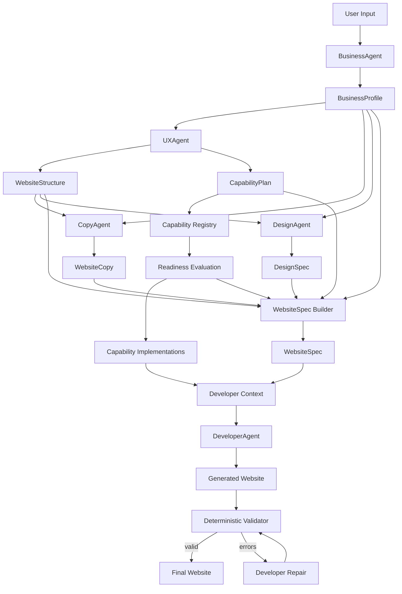

# WebAgent

WebAgent es un sistema multiagente en desarrollo que transforma la información de un pequeño negocio en una web profesional, funcional y validada con la mínima intervención manual posible.

El proyecto nació con un objetivo didáctico muy concreto: **entender y construir desde cero los mecanismos que hacen funcionar un sistema agentic** —structured outputs, tools, tool calling, estado compartido, validación, repair loops y coordinación entre agentes— antes de delegar esas decisiones a frameworks de alto nivel.

Actualmente WebAgent ya genera webs completas mediante un pipeline multiagente, valida automáticamente el resultado y está incorporando un sistema de **capabilities reutilizables** para que funcionalidades conocidas puedan resolverse con código determinista en lugar de regenerarse con un LLM en cada ejecución.

> **Estado:** desarrollo activo. El proyecto todavía no está planteado como producto estable para producción.

---

## Qué hace WebAgent

A partir de una descripción inicial de un negocio, WebAgent puede:

- Extraer un perfil estructurado del negocio.
- Diseñar la arquitectura UX de la web.
- Seleccionar las funcionalidades necesarias para cumplir el objetivo del negocio.
- Generar el copy de cada sección.
- Definir dirección visual, layout y requisitos de assets.
- Consolidar toda la información en un `WebsiteSpec` estructurado.
- Generar `HTML`, `CSS` y `JavaScript` mediante un DeveloperAgent con acceso controlado al filesystem.
- Validar de forma determinista la web generada.
- Reparar automáticamente errores detectados por el Validator.
- Integrar capabilities funcionales reutilizables sin regenerar su lógica desde cero.

---

## Arquitectura actual


```mermaid
flowchart TD
    A[User Input] --> B[BusinessAgent]
    B --> C[BusinessProfile]

    C --> D[UXAgent]
    D --> E[WebsiteStructure]
    D --> F[CapabilityPlan]

    C --> G[CopyAgent]
    E --> G
    G --> H[WebsiteCopy]

    C --> I[DesignAgent]
    E --> I
    I --> J[DesignSpec]

    F --> K[Capability Registry]
    K --> L[Readiness Evaluation]
    L --> M[Capability Implementations]

    C --> N[WebsiteSpec Builder]
    E --> N
    H --> N
    J --> N
    F --> N
    L --> N

    N --> O[WebsiteSpec]
    M --> P[Developer Context]
    O --> P

    P --> Q[DeveloperAgent]
    Q --> R[Generated Website]

    R --> S[Deterministic Validator]
    S -->|valid| T[Final Website]
    S -->|errors| U[Developer Repair]
    U --> S
```

La arquitectura intenta mantener responsabilidades muy claras:

- **Los agentes** toman decisiones que requieren razonamiento o generación.
- **Python** ejecuta acciones, mantiene estado, resuelve lógica conocida y aplica guardrails.
- **Pydantic** define contratos entre etapas.
- **El Validator** comprueba errores técnicos sin utilizar un LLM.
- **Las capabilities** encapsulan funcionalidades reutilizables que WebAgent ya sabe implementar.

---

## Agentes

### BusinessAgent

Analiza la descripción inicial del negocio y devuelve un `BusinessProfile` estructurado.

Actualmente puede utilizar tools mediante un agent loop genérico y un sistema de permisos por agente.

### UXAgent

Convierte el perfil del negocio en una estructura de navegación y secciones, y selecciona las capabilities necesarias mediante un `CapabilityPlan`.

### CopyAgent

Genera el contenido textual de cada sección sin inventar datos factuales. Cuando falta información necesaria, lo refleja explícitamente en su salida estructurada.

### DesignAgent

Define dirección visual, paleta, tipografía, layouts y requisitos de assets sin modificar el contenido factual del negocio.

### DeveloperAgent

Transforma el `WebsiteSpec` en una implementación web real utilizando tools de filesystem.

Dispone actualmente de dos modos:

- `generate`: genera la primera versión de la web.
- `repair`: corrige exclusivamente los errores detectados por el Validator.

El DeveloperAgent también recibe las `PREBUILT_CAPABILITY_IMPLEMENTATIONS` disponibles para integrar funcionalidades ya resueltas por WebAgent sin volver a generar su lógica.

---

## Shared State y WebsiteSpec

El workflow se coordina mediante un `ProjectState` que almacena progresivamente los resultados de cada fase:

```text
ProjectState
├── business
├── ux
├── capability_plan
├── capability_inputs
├── website_copy
├── design
├── website_spec
├── development
└── validation
```

Antes del desarrollo, WebAgent consolida la información necesaria en un `WebsiteSpec`.

Esto evita que el DeveloperAgent tenga que reconstruir decisiones tomadas anteriormente y reduce el acoplamiento entre agentes.

---

## Sistema de Capabilities

Una capability representa una funcionalidad reutilizable que una web puede necesitar: WhatsApp, mapas, reservas, formularios, galerías, analítica, etc.

La arquitectura separa cuatro conceptos:

```text
CapabilityPlan
      ↓
CapabilityDefinition
      ↓
CapabilityReadiness
      ↓
CapabilityImplementation
```

### CapabilityDefinition

Describe:

- qué hace la capability;
- qué inputs necesita;
- qué requisitos debe respetar el DeveloperAgent.

### CapabilityReadiness

Comprueba si WebAgent dispone de los datos necesarios para activar una capability.

Ejemplo:

```text
whatsapp
required_inputs = ["whatsapp_number"]

whatsapp_number disponible
        ↓
ready = true
```

Si faltan datos, la capability se mantiene como `ready=false` y WebAgent no simula una funcionalidad que realmente no puede ejecutar.

### CapabilityImplementation

Contiene código funcional reutilizable:

```python
class CapabilityImplementation(BaseModel):
    type: CapabilityType
    html: str
    css: str
    javascript: str
    implementation_notes: list[str]
```

El DeveloperAgent recibe estas implementaciones ya construidas y se encarga de **integrarlas visualmente**, no de reinventar su comportamiento.

### Implementaciones actuales

- [x] WhatsApp (`wa.me`)
- [x] Google Maps
- [ ] Contact form
- [ ] Gallery
- [ ] Reviews
- [ ] Booking
- [ ] Analytics

WhatsApp y Maps ya han sido probadas conjuntamente en una generación end-to-end y funcionan correctamente en la web final.

---

## Tools y Agent Loop

Los agentes no ejecutan funciones directamente. Solicitan tools y Python decide si están permitidas y cómo ejecutarlas.

Cada tool tiene:

- una `definition` visible para el modelo;
- un `handler` Python que realiza la acción real.

Ambas caras se unen en `TOOL_SPECS`, del que se deriva el `TOOL_REGISTRY`.

```text
Agent
  ↓
function_call
  ↓
Tool Executor
  ↓
Tool Registry
  ↓
Python handler
  ↓
function_call_output
  ↓
Agent
```

El `AgentRunner` es genérico y no conoce tools concretas. Cada `AgentConfig` define su modelo, instrucciones, tools permitidas y schema de salida.

---

## Validator determinista

Después de generar la web, WebAgent ejecuta un Validator escrito en Python.

Actualmente comprueba, entre otros aspectos:

- existencia y contenido de archivos requeridos;
- estructura HTML;
- referencias a stylesheets;
- IDs HTML duplicados;
- enlaces internos rotos;
- errores básicos de CSS;
- errores básicos de JavaScript.

Si la web no es válida:

```text
Validator
   ↓
ValidationResult
   ↓
DeveloperAgent / MODE: repair
   ↓
Validator
```

El número de intentos de reparación está limitado para evitar loops infinitos.

---

## Estructura del proyecto

```text
src/
├── agents/
│   ├── agent_config.py
│   ├── agent_runner.py
│   ├── business_agent.py
│   ├── ux_agent.py
│   ├── copy_agent.py
│   ├── design_agent.py
│   └── developer_agent.py
│
├── capabilities/
│   ├── capability_inputs.py
│   ├── capability_readiness.py
│   ├── capability_registry.py
│   ├── capability_implementation.py
│   ├── capability_resolver.py
│   ├── implementation_registry.py
│   └── implementations/
│       ├── whatsapp.py
│       └── maps.py
│
├── context/
│   └── context_builders.py
│
├── specs/
│   ├── capability_spec.py
│   ├── website_spec.py
│   └── website_spec_builder.py
│
├── state/
│   └── project_state.py
│
├── tools/
│   ├── business_tools.py
│   ├── filesystem_tools.py
│   └── tool_registry.py
│
├── validation/
├── tests/
└── main.py
```

---

## Instalación

### 1. Clonar el repositorio

```bash
git clone https://github.com/manumnzz/WebAgent.git
cd WebAgent
```

### 2. Crear y activar un entorno virtual

```bash
python3 -m venv .venv
source .venv/bin/activate
```

En Windows:

```bash
.venv\Scripts\activate
```

### 3. Instalar dependencias

```bash
pip install -r requirements.txt
```

### 4. Configurar credenciales

Crear un archivo `.env` en la raíz del proyecto:

```env
OPENAI_API_KEY=tu_api_key
```

`.env` no debe subirse al repositorio.

### 5. Ejecutar WebAgent

```bash
python src/main.py
```

### 6. Ejecutar los tests

```bash
pytest
```

---

## Principios de diseño

WebAgent sigue varias reglas arquitectónicas que guían su evolución:

1. **No utilizar un LLM para resolver lógica que puede ser determinista.**
2. **Mantener contratos estructurados entre componentes.**
3. **Separar decisión, ejecución y validación.**
4. **Evitar lógica específica distribuida mediante registries y resolvers genéricos.**
5. **No inventar información del negocio cuando faltan datos.**
6. **Limitar explícitamente loops y procesos de reparación.**
7. **Añadir abstracciones solo cuando resuelven un problema real.**
8. **Medir coste y calidad antes de optimizar modelos.**

---

## Roadmap

El backlog activo se gestiona mediante GitHub Issues.

### En progreso

- [#2 — Completar sistema de capabilities reutilizables](https://github.com/manumnzz/WebAgent/issues/2)

### Próximos objetivos

- [#3 — Optimizar agentes con SLM/LLM routing y control de costes](https://github.com/manumnzz/WebAgent/issues/3)
- [#4 — Implementar recolección automática de información faltante](https://github.com/manumnzz/WebAgent/issues/4)
- [#5 — Implementar recolección y gestión de multimedia](https://github.com/manumnzz/WebAgent/issues/5)
- [#6 — Añadir revisión humana y modo `revise` al DeveloperAgent](https://github.com/manumnzz/WebAgent/issues/6)

### Mejoras detectadas

- [#1 — Controlar placement y duplicación de capabilities en la web final](https://github.com/manumnzz/WebAgent/issues/1)

---

## Dirección técnica

Las siguientes líneas de evolución están previstas para las próximas iteraciones:

- completar el catálogo de capabilities;
- obtener automáticamente información pública que falte en el input inicial;
- recolectar y gestionar fotografías, logos y otros assets del negocio;
- incorporar una fase de revisión humana posterior a la validación técnica;
- medir tokens, latencia y coste por agente;
- asignar modelos más pequeños a tareas simples y reservar modelos más potentes para desarrollo y reparación compleja;
- mantener el máximo número posible de tareas en código determinista.

---

## Filosofía del proyecto

WebAgent se construye de forma incremental y deliberada.

El objetivo no es acumular agentes, prompts o frameworks, sino crear un sistema donde cada componente tenga:

- una responsabilidad concreta;
- un contrato explícito;
- una razón clara para existir;
- un comportamiento observable y testeable.

La prioridad es entender la arquitectura y poder justificar cada decisión técnica antes de abstraerla.
