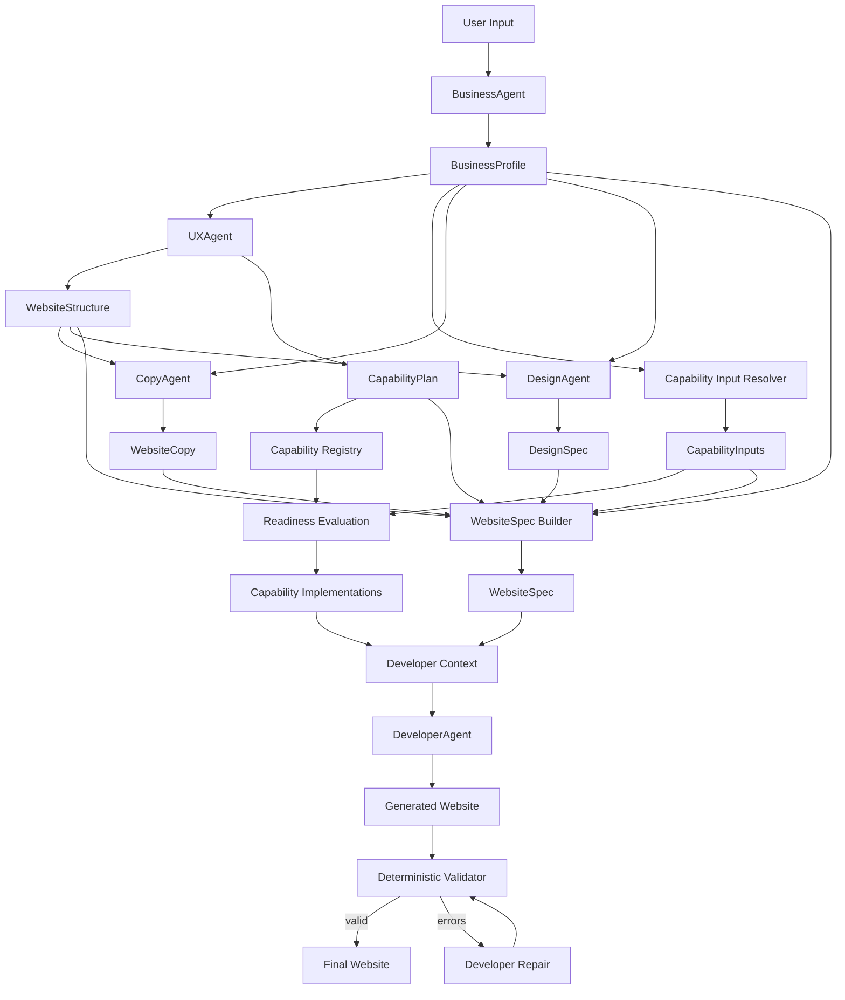

# WebAgent

WebAgent es un sistema multiagente en desarrollo que transforma la información de un pequeño negocio en una web profesional, funcional y validada con la mínima intervención manual posible.

El proyecto nació con un objetivo didáctico muy concreto: **entender y construir desde cero los mecanismos que hacen funcionar un sistema agentic** —structured outputs, tools, tool calling, estado compartido, validación, repair loops y coordinación entre agentes— antes de delegar esas decisiones a frameworks de alto nivel.

Actualmente WebAgent ya genera webs completas mediante un pipeline multiagente, valida automáticamente el resultado e integra **capabilities reutilizables** para resolver funcionalidades conocidas mediante código determinista en lugar de regenerarlas con un LLM en cada ejecución.

> **Estado:** desarrollo activo. El proyecto todavía no está planteado como producto estable para producción.

---

## Qué hace WebAgent

A partir de una descripción inicial de un negocio, WebAgent puede:

- Extraer un perfil estructurado del negocio.
- Conservar datos de contacto e intenciones explícitas del usuario sin perder información entre etapas.
- Diseñar la arquitectura UX de la web.
- Seleccionar las funcionalidades necesarias para cumplir el objetivo del negocio.
- Resolver automáticamente inputs de capabilities a partir de datos ya conocidos del negocio.
- Generar el copy de cada sección.
- Definir dirección visual, layout y requisitos de assets.
- Consolidar toda la información en un `WebsiteSpec` estructurado.
- Generar `HTML`, `CSS` y `JavaScript` mediante un DeveloperAgent con acceso controlado al filesystem.
- Validar de forma determinista la web generada.
- Reparar automáticamente errores detectados por el Validator.
- Integrar capabilities funcionales reutilizables sin regenerar su lógica desde cero.

---

## Arquitectura actual


```mermaid
flowchart TD
    A[User Input] --> B[BusinessAgent]
    B --> C[BusinessProfile]

    C --> D[UXAgent]
    D --> E[WebsiteStructure]
    D --> F[CapabilityPlan]

    C --> G[Capability Input Resolver]
    G --> H[CapabilityInputs]

    C --> I[CopyAgent]
    E --> I
    I --> J[WebsiteCopy]

    C --> K[DesignAgent]
    E --> K
    K --> L[DesignSpec]

    F --> M[Capability Registry]
    H --> N[Readiness Evaluation]
    M --> N
    N --> O[Capability Implementations]

    C --> P[WebsiteSpec Builder]
    E --> P
    J --> P
    L --> P
    F --> P
    H --> P

    P --> Q[WebsiteSpec]
    O --> R[Developer Context]
    Q --> R

    R --> S[DeveloperAgent]
    S --> T[Generated Website]

    T --> U[Deterministic Validator]
    U -->|valid| V[Final Website]
    U -->|errors| W[Developer Repair]
    W --> U
```

La arquitectura intenta mantener responsabilidades muy claras:

- **Los agentes** toman decisiones que requieren razonamiento o generación.
- **Python** ejecuta acciones, mantiene estado, resuelve lógica conocida y aplica guardrails.
- **Pydantic** define contratos entre etapas.
- **El Validator** comprueba errores técnicos sin utilizar un LLM.
- **Las capabilities** encapsulan funcionalidades reutilizables que WebAgent ya sabe implementar.

---

## Agentes

### BusinessAgent

Analiza la descripción inicial del negocio y devuelve un `BusinessProfile` estructurado.

Además de los datos básicos del negocio, actualmente conserva:

- `requested_features`: funcionalidades, canales o características solicitadas explícitamente por el usuario;
- `contact`: teléfono, WhatsApp, email y dirección cuando están disponibles.

Esto evita pérdida de información entre etapas. El BusinessAgent no selecciona capabilities ni toma decisiones técnicas: preserva la intención y los datos factuales.

Actualmente puede utilizar tools mediante un agent loop genérico y un sistema de permisos por agente.

### UXAgent

Convierte el perfil del negocio en una estructura de navegación y secciones, y selecciona las capabilities necesarias mediante un `CapabilityPlan`.

### CopyAgent

Genera el contenido textual de cada sección sin inventar datos factuales. Cuando falta información necesaria, lo refleja explícitamente en su salida estructurada.

### DesignAgent

Define dirección visual, paleta, tipografía, layouts y requisitos de assets sin modificar el contenido factual del negocio.

### DeveloperAgent

Transforma el `WebsiteSpec` en una implementación web real utilizando tools de filesystem.

Dispone actualmente de dos modos:

- `generate`: genera la primera versión de la web.
- `repair`: corrige exclusivamente los errores detectados por el Validator.

El DeveloperAgent también recibe las `PREBUILT_CAPABILITY_IMPLEMENTATIONS` disponibles para integrar funcionalidades ya resueltas por WebAgent sin volver a generar su lógica.

---

## Shared State y WebsiteSpec

El workflow se coordina mediante un `ProjectState` que almacena progresivamente los resultados de cada fase:

```text
ProjectState
├── business
├── ux
├── capability_plan
├── capability_inputs
├── website_copy
├── design
├── website_spec
├── development
└── validation
```

Antes del desarrollo, WebAgent consolida la información necesaria en un `WebsiteSpec`.

Esto evita que el DeveloperAgent tenga que reconstruir decisiones tomadas anteriormente y reduce el acoplamiento entre agentes.

---

## Preservación y resolución de información

Durante el desarrollo se detectó un problema importante: si el schema de salida de un agente no representa una información necesaria para etapas posteriores, esa información desaparece del pipeline.

Para evitarlo, `BusinessProfile` conserva ahora tanto los datos factuales relevantes como las funcionalidades solicitadas explícitamente.

Ejemplo:

```text
"Quiero una galería"
        ↓
BusinessProfile.requested_features
        ↓
UXAgent
        ↓
CapabilityPlan: gallery
```

Mientras que los datos concretos utilizados por una capability siguen una ruta separada:

```text
BusinessProfile.contact.whatsapp
        ↓
Capability Input Resolver
        ↓
CapabilityInputs.whatsapp_number
```

El `Capability Input Resolver` traduce actualmente datos conocidos del negocio a inputs reutilizables:

- `contact.whatsapp` → `whatsapp_number`
- `contact.email` → `contact_destination`
- `contact.address` → `business_address`

Además conserva inputs ya existentes, permitiendo que en el futuro otras fuentes —por ejemplo un Media Collector o un Information Collector— completen `CapabilityInputs` sin perder datos previos.

---

## Sistema de Capabilities

Una capability representa una funcionalidad reutilizable que una web puede necesitar: WhatsApp, mapas, reservas, formularios, galerías, reseñas, analítica, etc.

La arquitectura separa varios conceptos:

```text
CapabilityPlan
      ↓
CapabilityDefinition
      ↓
CapabilityInputs
      ↓
CapabilityReadiness
      ↓
CapabilityImplementation
```

### CapabilityDefinition

Describe:

- qué hace la capability;
- qué inputs necesita;
- qué requisitos debe respetar el DeveloperAgent.

### CapabilityInputs

Contiene únicamente los datos reales disponibles para activar funcionalidades concretas.

Los inputs evolucionan hacia modelos tipados cuando la complejidad de la capability lo requiere. Actualmente existen modelos específicos como `ReviewData` y `BookingConfiguration`.

### CapabilityReadiness

Comprueba si WebAgent dispone de los datos necesarios para activar una capability.

Ejemplo:

```text
whatsapp
required_inputs = ["whatsapp_number"]

whatsapp_number disponible
        ↓
ready = true
```

Si faltan datos, la capability se mantiene como `ready=false` y WebAgent no simula una funcionalidad que realmente no puede ejecutar.

### CapabilityImplementation

Contiene código funcional reutilizable:

```python
class CapabilityImplementation(BaseModel):
    type: CapabilityType
    html: str
    css: str
    javascript: str
    implementation_notes: list[str]
```

El DeveloperAgent recibe estas implementaciones ya construidas y se encarga de **integrarlas visualmente**, no de reinventar su comportamiento.

### Implementaciones actuales integradas en el pipeline

- [x] WhatsApp (`wa.me`)
- [x] Google Maps
- [x] Contact form
- [x] Gallery
- [x] Reviews
- [ ] Booking — motor V1 funcional; pendiente integrarlo en el registry/pipeline
- [ ] Analytics

Las cinco primeras capabilities han sido probadas simultáneamente en una generación end-to-end y se integran correctamente en la misma web final.

### Capabilities ya validadas

#### WhatsApp

Normaliza el número recibido y genera un enlace funcional mediante `wa.me`.

#### Google Maps

Construye una URL de Google Maps a partir de una dirección real del negocio.

#### Contact form

Genera una estructura de formulario funcional usando un destino de contacto real. Actualmente utiliza `mailto:` como primera implementación determinista, sin simular un backend inexistente.

#### Gallery

Recibe una colección de assets y genera HTML repetible para mostrarlos sin inventar fotografías del negocio.

#### Reviews

Utiliza `ReviewData` tipado con Pydantic y valida autor, texto y rating. Las valoraciones están restringidas al rango 1–5 y el contenido se escapa antes de insertarse en HTML.

---

## Booking V1

Durante el Día 13 se construyó el motor funcional de reservas de WebAgent como subsistema desacoplado del pipeline principal de capabilities.

### Principios de diseño

Booking V1 sigue estas decisiones:

- el **calendario externo es la fuente de verdad** de disponibilidad y reservas;
- no existe una base de datos propia de reservas en V1;
- no existe un panel administrativo propio en V1;
- una reserva válida se confirma automáticamente, sin estado `pending` ni confirmación manual del negocio;
- antes de crear el evento se vuelve a consultar la disponibilidad para reducir dobles reservas;
- las credenciales OAuth nunca forman parte de `CapabilityInputs`, `WebsiteSpec` ni del contexto enviado a un LLM;
- la integración con calendarios se realiza mediante una abstracción `CalendarProvider`, evitando acoplar el dominio a Google Calendar.

Arquitectura actual:

```text
Frontend /reservar
        ↓
Booking API
        ↓
BookingManager
        ↓
Availability Engine
        ↓
CalendarProvider
        ↓
GoogleCalendarProvider
        ↓
Google Calendar
```

### Dominio y configuración

`BookingConfiguration` representa la configuración de reservas de un negocio:

```text
BookingConfiguration
├── timezone
├── services[]
│   ├── id
│   ├── name
│   └── duration_minutes
├── weekly_schedule[]
│   ├── weekday
│   └── ranges[]
└── slot_interval_minutes
```

La configuración se carga actualmente desde `config/booking.json` mediante `config_loader.py`. El fichero actual sirve como configuración de desarrollo; el objetivo es que WebAgent lo construya automáticamente a partir de la información del negocio y de datos adicionales recogidos cuando falten.

Los `service_id` son identificadores técnicos. La dirección prevista es generarlos de forma determinista a partir del nombre del servicio y persistirlos en la configuración, evitando pedir al negocio que gestione IDs manualmente.

### Availability Engine

El motor de disponibilidad combina:

- horario semanal del negocio;
- duración del servicio;
- intervalo de slots;
- zona horaria;
- intervalos ocupados del calendario externo.

Utiliza intervalos semiabiertos para permitir, por ejemplo, una nueva reserva exactamente cuando termina el evento anterior.

### CalendarProvider

El dominio depende de la interfaz `CalendarProvider`, no de Google directamente.

Implementaciones actuales:

- `FakeCalendarProvider`: tests automatizados sin servicios externos;
- `GoogleCalendarProvider`: consulta `freeBusy`, crea eventos y permite cancelarlos mediante Google Calendar API.

Esto deja abierta la incorporación futura de otros proveedores, por ejemplo Microsoft Calendar, sin modificar `BookingManager`.

### BookingManager

`BookingManager` coordina el caso de uso:

```text
BookingRequest
      ↓
resolver servicio
      ↓
consultar disponibilidad actual
      ↓
¿slot todavía disponible?
   ├── no → BookingSlotUnavailableError
   └── sí
        ↓
crear evento
        ↓
BookingConfirmation
```

La API traduce un slot ocupado a `409 Conflict`.

### API HTTP

Booking dispone de una API FastAPI mínima:

```text
GET  /booking/services
GET  /booking/availability
POST /booking
GET  /health
```

`GET /booking/services` permite que el frontend descubra dinámicamente los servicios del negocio sin hardcodear nombres o IDs.

### Frontend de referencia

Existe una interfaz funcional en:

```text
/reservar
```

El frontend:

1. carga servicios desde la API;
2. consulta disponibilidad al elegir servicio y fecha;
3. solicita nombre, contacto y notas;
4. crea la reserva mediante `POST /booking`;
5. vuelve a consultar disponibilidad tras confirmar la reserva.

Se ha validado manualmente el flujo completo navegador → API → Google Calendar real → disponibilidad actualizada.

### OAuth y seguridad

La integración local con Google Calendar utiliza OAuth 2.0.

Los archivos:

```text
credentials.json
token.json
```

están excluidos del repositorio mediante `.gitignore`.

Scopes utilizados:

```text
https://www.googleapis.com/auth/calendar.events
https://www.googleapis.com/auth/calendar.freebusy
```

### Estado de Booking

```text
Modelos de dominio             ✅
Availability Engine            ✅
BookingManager                 ✅
CalendarProvider               ✅
FakeCalendarProvider           ✅
GoogleCalendarProvider         ✅
OAuth Google                   ✅
API HTTP                       ✅
Configuración externa          ✅
Frontend /reservar             ✅
Reserva real navegador → GCal  ✅
Integración Capability Registry ⏳
Generación automática config   ⏳
Information Collector          ⏳
```

Por tanto, **Booking V1 es funcional como subsistema**, pero todavía no se considera una capability completamente terminada hasta integrarla en el workflow normal de WebAgent.

### Evolución prevista de Booking

Siguiente fase:

```text
BusinessProfile
      ↓
Information Collector
      ↓
Booking Configuration Builder
      ↓
BookingConfiguration
      ↓
CapabilityInputs
      ↓
CapabilityReadiness
      ↓
BookingImplementation
      ↓
Implementation Registry
      ↓
DeveloperAgent
```

Más adelante podrán añadirse sin bloquear V1:

- emails de confirmación/cancelación;
- webhooks o push notifications del proveedor de calendario para detectar cambios externos;
- WhatsApp como canal opcional de notificación;
- Microsoft Calendar u otros providers;
- reglas adicionales como antelación mínima, horizonte máximo o buffers entre reservas;
- protección más fuerte frente a concurrencia real en despliegues distribuidos.

No forman parte del alcance actual: base de datos propia de reservas, panel administrativo completo o sistema multi-tenant.

---

## Tools y Agent Loop

Los agentes no ejecutan funciones directamente. Solicitan tools y Python decide si están permitidas y cómo ejecutarlas.

Cada tool tiene:

- una `definition` visible para el modelo;
- un `handler` Python que realiza la acción real.

Ambas caras se unen en `TOOL_SPECS`, del que se deriva el `TOOL_REGISTRY`.

```text
Agent
  ↓
function_call
  ↓
Tool Executor
  ↓
Tool Registry
  ↓
Python handler
  ↓
function_call_output
  ↓
Agent
```

El `AgentRunner` es genérico y no conoce tools concretas. Cada `AgentConfig` define su modelo, instrucciones, tools permitidas y schema de salida.

---

## Validator determinista

Después de generar la web, WebAgent ejecuta un Validator escrito en Python.

Actualmente comprueba, entre otros aspectos:

- existencia y contenido de archivos requeridos;
- estructura HTML;
- referencias a stylesheets;
- IDs HTML duplicados;
- enlaces internos rotos;
- errores básicos de CSS;
- errores básicos de JavaScript.

Si la web no es válida:

```text
Validator
   ↓
ValidationResult
   ↓
DeveloperAgent / MODE: repair
   ↓
Validator
```

El número de intentos de reparación está limitado para evitar loops infinitos.

---

## Estructura del proyecto

```text
config/
└── booking.json

scripts/
└── test_manual_google_calendar.py

src/
├── agents/
│   ├── agent_config.py
│   ├── agent_runner.py
│   ├── business_agent.py
│   ├── ux_agent.py
│   ├── copy_agent.py
│   ├── design_agent.py
│   └── developer_agent.py
│
├── api/
│   ├── main.py
│   ├── booking_api.py
│   └── static/
│       └── booking.html
│
├── capabilities/
│   ├── booking/
│   │   ├── availability.py
│   │   ├── booking_manager.py
│   │   ├── calendar_provider.py
│   │   ├── config_loader.py
│   │   ├── fake_calendar_provider.py
│   │   └── google_calendar_provider.py
│   ├── capability_input_resolver.py
│   ├── capability_inputs.py
│   ├── capability_readiness.py
│   ├── capability_registry.py
│   ├── capability_implementation.py
│   ├── capability_resolver.py
│   ├── implementation_registry.py
│   ├── models/
│   │   ├── booking.py
│   │   └── review.py
│   └── implementations/
│       ├── whatsapp.py
│       ├── maps.py
│       ├── contact_form.py
│       ├── gallery.py
│       └── reviews.py
│
├── integrations/
│   └── google_calendar_auth.py
│
├── context/
├── specs/
├── state/
├── tools/
├── validation/
├── tests/
└── main.py
```

---

## Instalación

### 1. Clonar el repositorio

```bash
git clone https://github.com/manumnzz/WebAgent.git
cd WebAgent
```

### 2. Crear y activar un entorno virtual

```bash
python3 -m venv .venv
source .venv/bin/activate
```

En Windows:

```bash
.venv\Scripts\activate
```

### 3. Instalar dependencias

```bash
pip install -r requirements.txt
```

### 4. Configurar OpenAI

Crear un archivo `.env` en la raíz del proyecto:

```env
OPENAI_API_KEY=tu_api_key
```

`.env` no debe subirse al repositorio.

### 5. Ejecutar WebAgent

```bash
python src/main.py
```

### 6. Ejecutar los tests

```bash
pytest
```

### 7. Ejecutar Booking API en desarrollo

Para utilizar la integración real con Google Calendar es necesario disponer localmente de `credentials.json` y completar el flujo OAuth para generar `token.json`.

```bash
uvicorn api.main:app --reload --app-dir src
```

Después se puede abrir:

```text
http://127.0.0.1:8000/reservar
http://127.0.0.1:8000/docs
```

---

## Principios de diseño

WebAgent sigue varias reglas arquitectónicas que guían su evolución:

1. **No utilizar un LLM para resolver lógica que puede ser determinista.**
2. **Mantener contratos estructurados entre componentes.**
3. **Separar decisión, ejecución y validación.**
4. **Evitar lógica específica distribuida mediante registries y resolvers genéricos.**
5. **No inventar información del negocio cuando faltan datos.**
6. **Preservar la información necesaria entre etapas mediante schemas explícitos.**
7. **Separar intención del usuario de los datos técnicos necesarios para ejecutar una capability.**
8. **Limitar explícitamente loops y procesos de reparación.**
9. **Añadir abstracciones solo cuando resuelven un problema real.**
10. **Medir coste y calidad antes de optimizar modelos.**
11. **Mantener credenciales y secretos fuera del contexto de los modelos.**
12. **Usar proveedores externos detrás de interfaces cuando el dominio no deba depender de una implementación concreta.**

---

## Roadmap

El backlog activo se gestiona mediante GitHub Issues.

### En progreso

- [#2 — Completar sistema de capabilities reutilizables](https://github.com/manumnzz/WebAgent/issues/2)

Estado actual del objetivo:

- [x] WhatsApp
- [x] Maps
- [x] Contact form
- [x] Gallery
- [x] Reviews
- [ ] Booking — V1 funcional fuera del pipeline; siguiente paso: integración como capability
- [ ] Analytics
- [ ] Prueba global final de todas las capabilities

### Próximo paso inmediato

Integrar el subsistema Booking ya funcional en la arquitectura de capabilities:

```text
BookingConfiguration
        ↓
CapabilityInputs
        ↓
CapabilityReadiness
        ↓
BookingImplementation
        ↓
Implementation Registry
        ↓
DeveloperAgent
```

Después se abordará la generación automática de `BookingConfiguration` a partir del perfil del negocio y de información adicional recopilada cuando falten duraciones, horarios u otros datos obligatorios.

### Próximos objetivos

- [#3 — Optimizar agentes con SLM/LLM routing y control de costes](https://github.com/manumnzz/WebAgent/issues/3)
- [#4 — Implementar recolección automática de información faltante](https://github.com/manumnzz/WebAgent/issues/4)
- [#5 — Implementar recolección y gestión de multimedia](https://github.com/manumnzz/WebAgent/issues/5)
- [#6 — Añadir revisión humana y modo `revise` al DeveloperAgent](https://github.com/manumnzz/WebAgent/issues/6)

### Mejoras detectadas

- [#1 — Controlar placement y duplicación de capabilities en la web final](https://github.com/manumnzz/WebAgent/issues/1)

---

## Dirección técnica

Las siguientes líneas de evolución están previstas para las próximas iteraciones:

- terminar la integración de Booking y completar Analytics;
- generar configuraciones de capabilities a partir de información real del negocio;
- obtener automáticamente información pública que falte en el input inicial;
- recolectar y gestionar fotografías, logos y otros assets del negocio;
- incorporar una fase de revisión humana posterior a la validación técnica;
- medir tokens, latencia y coste por agente;
- asignar modelos más pequeños a tareas simples y reservar modelos más potentes para desarrollo y reparación compleja;
- mantener el máximo número posible de tareas en código determinista.

---

## Filosofía del proyecto

WebAgent se construye de forma incremental y deliberada.

El objetivo no es acumular agentes, prompts o frameworks, sino crear un sistema donde cada componente tenga:

- una responsabilidad concreta;
- un contrato explícito;
- una razón clara para existir;
- un comportamiento observable y testeable.

La prioridad es entender la arquitectura y poder justificar cada decisión técnica antes de abstraerla.